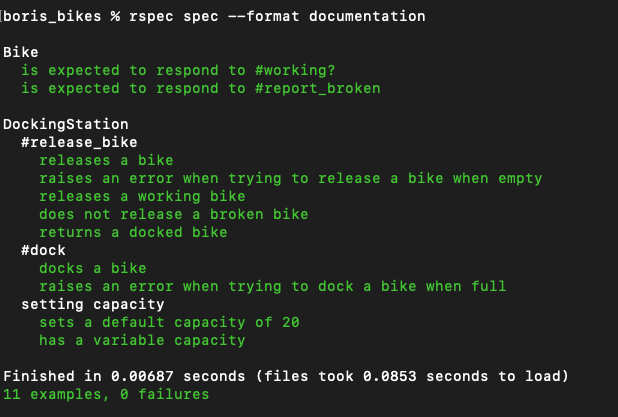

# Boris bikes


```
                                          $"   *.      
              d$$$$$$$P"                  $    J
                  ^$.                     4r  "
                  d"b                    .db
                 P   $                  e" $
        ..ec.. ."     *.              zP   $.zec..
    .^        3*b.     *.           .P" .@"4F      "4
  ."         d"  ^b.    *c        .$"  d"   $         %
 /          P      $.    "c      d"   @     3r         3
4        .eE........$r===e$$$$eeP    J       *..        b
$       $$$$$       $   4$$$$$$$     F       d$$$.      4
$       $$$$$       $   4$$$$$$$     L       *$$$"      4
4         "      ""3P ===$$$$$$"     3                  P
 *                 $       """        b                J
  ".             .P                    %.             @
    %.         z*"                      ^%.        .r"
       "*==*""                             ^"*==*""   

```

## Introduction

This is my solution to the week 1 exercise at Makers which is to model the Boris bikes system in London. The solution builds on my learnings from the week including TDD, debugging & mocks/doubles.

## How to use

#### To set up the project

Clone this repo and then run 

```
bundle install
```
#### To create a docking station

Open IRB and load the 'docking_station.rb' file in the 'lib' folder. Instantiate a docking station by calling DS.new. The docking station class can dock and release bike objects.

```
boris_bikes % irb       
2.7.3 :001 > require './lib/docking_station.rb'
 => true 
2.7.3 :002 > DS = DockingStation.new
 => #<DockingStation:0x00007fbd7f96c258 @bikes=[], @capacity=20> 
2.7.3 :003 > 
```

#### To create a bike

Open IRB and load the 'bike.rb' file in the 'lib' folder. Instantiate a bike by calling Bike.new.

```
2.7.3 :003 > require './lib/bike.rb'
 => true 
2.7.3 :004 > bike = Bike.new
 => #<Bike:0x00007fbd7f9764d8 @status=true> 
```

#### Docking station methods

A docking station can dock a plane with dock(bike):

```
2.7.3 :005 > DS.dock(bike)
 => [#<Bike:0x00007fbd7f9764d8 @status=true>] 
```

A docking station can release a bike with release_bike:

```
2.7.3 :006 > DS.release_bike
 => #<Bike:0x00007fbd7f9764d8 @status=true> 
```

Guard conditions and logic have been implemented such that:
- A bike cannot dock if the docking station is full
- A bike cannot be released if its broken

If any of the conditions above are met then the user is given an error message.

## Testing

All testing was completed in RSpec, a screenshot of the output is below:


## User stories

The following user stories were implemented as part of this project:
```
As a person,
So that I can use a bike,
I'd like a docking station to release a bike.

As a person,
So that I can use a good bike,
I'd like to see if a bike is working

As a system maintainer,
So that I can plan the distribution of bikes,
I want a docking station to have a default capacity of 20 bikes.

As a system maintainer,
So that busy areas can be served more effectively,
I want to be able to specify a larger capacity when necessary.

As a member of the public,
So that I reduce the chance of getting a broken bike in future,
I'd like to report a bike as broken when I return it.

As a maintainer of the system,
So that I can manage broken bikes and not disappoint users,
I'd like docking stations not to release broken bikes.

As a maintainer of the system,
So that I can manage broken bikes and not disappoint users,
I'd like docking stations to accept returning bikes (broken or not).

```


Original README [here](https://github.com/makersacademy/course/blob/main/boris_bikes/0_challenge_map.md)